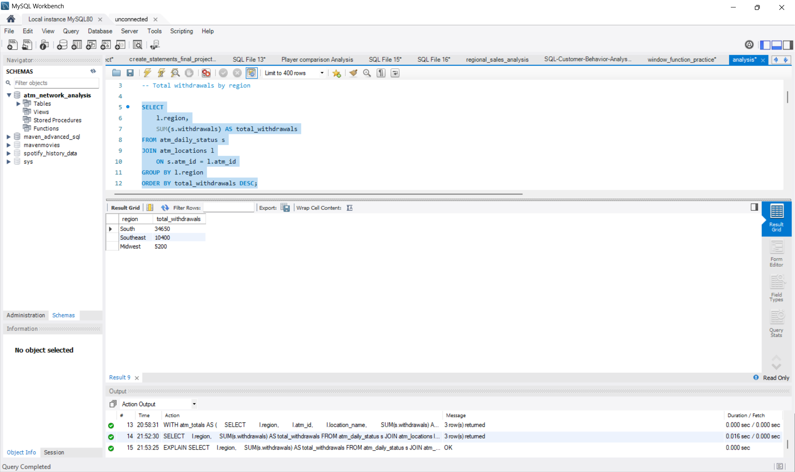

# ATM Network Operations Analysis

## Project Overview

This project analyzes ATM operational data using SQL to simulate how network operations teams monitor ATM performance, cash levels, and vendor activity.

The analysis focuses on identifying high-performing ATM locations, evaluating armored carrier workload, detecting low-cash risk, and comparing transaction activity between bank-branded and non-bank ATM machines.

## Business Context

ATM networks require continuous monitoring to maintain availability, manage cash levels, and ensure reliable service for customers.

Operational teams track transaction volumes, cash levels, and service vendor performance across regions to identify potential issues before they impact customer access.

This project simulates how SQL-based analysis can be used to evaluate ATM network performance, including regional withdrawal activity, armored carrier service coverage, and differences between bank-branded and non-bank ATM locations.

## Business Questions

- Which ATM locations process the highest withdrawal volume?
- Which armored carrier services the most ATM transactions?
- Do bank-branded ATMs generate higher transaction activity than non-bank ATMs?
- Which regions show the highest withdrawal demand?
- Which ATM locations are most at risk of running low on cash?

## Key Analysis

### Regional Withdrawal Demand
Identifies regions with the highest ATM withdrawal activity.

### Low Cash Risk Detection
Flags ATM machines approaching low cash thresholds that may require armored vendor dispatch.

### Vendor Workload Analysis
Evaluates the distribution of ATM service activity across armored vendors.

### Bank-Branded ATM Performance
Compares withdrawal demand between bank-branded and non-bank ATM locations.


### Top ATM by Region
Uses SQL window functions to rank the highest-performing ATM in each region.

## Sample Query Results


### SQL Analysis Workspace



---

### Bank vs Non-Bank ATM Performance

```sql
SELECT
    l.bank_branded,
    COUNT(DISTINCT l.atm_id) AS total_atms,
    SUM(s.withdrawals) AS total_withdrawals,
    ROUND(AVG(s.withdrawals),2) AS avg_withdrawals
FROM atm_daily_status s
JOIN atm_locations l
    ON s.atm_id = l.atm_id
GROUP BY l.bank_branded;


## SQL Skills Demonstrated

- JOIN operations
- GROUP BY aggregation
- Conditional filtering
- Common Table Expressions (CTEs)
- Window Functions (`RANK`)
- `PARTITION BY`
- Operational data analysis

## Tools Used

- MySQL
- SQL

## Example Business Insight

Analysis of ATM withdrawal data revealed:

- Bank-branded ATMs averaged **4,800 withdrawals**
- Non-bank ATMs averaged **2,383 withdrawals**

This suggests bank-branded locations drive significantly higher transaction demand, likely due to customer trust and brand familiarity.

Additionally, regional ranking identified the highest-performing ATM in each region using SQL window functions.

## Project Files

- `schema.sql` – database and table creation
- `sample_data.sql` – sample ATM network data
- `analysis.sql` – SQL analysis queries
- `README.md` – project documentation

## Author

**Sean Codner**  
Operations & Data Analyst

Background in ATM network operations, forecasting, and service performance analysis. Currently expanding operational analytics capabilities using SQL and data analysis.

**LinkedIn:**  
https://linkedin.com/in/sean-codner-aa60822b
```
